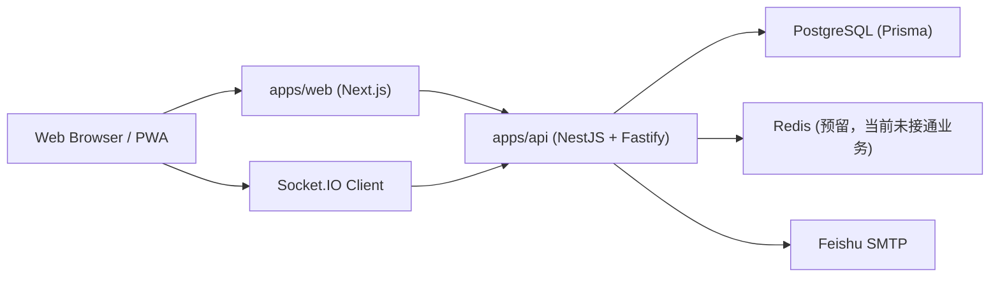

# 语闻技术架构文档

## 1. 文档目的

这份文档说明当前仓库中“语闻”首发版本的整体技术架构、模块边界、关键数据流、设计原理和当前实现状态。

它回答四个核心问题：

1. 这个系统被拆成了哪些模块
2. 每个模块各自负责什么
3. 关键业务是怎么流动起来的
4. 为什么当前要这样设计，而不是更复杂或更理想化的方案

这份文档基于当前仓库的真实实现整理，而不是理想化蓝图。因此文档中会明确区分：

- 已落地实现
- 演示态实现
- 预留但尚未接通的能力

---

## 2. 产品目标与架构原则

### 2.1 产品目标

语闻是一个 `1 对 1`、Web 优先、后续可平滑扩展到移动端的聊天系统。首发版本重点不是“功能越多越好”，而是先把下面这些基础能力做扎实：

- 邮箱身份体系
- password / auth code / magic link 三种认证入口
- `friendCode` 与 `@handle` 双标识体系
- 已读、正在输入、编辑消息、删除消息
- 多设备模型预留
- 后续端到端加密接入的协议和界面空间

### 2.2 核心架构原则

当前仓库贯彻了几个非常重要的原则。

#### 1. Web 先行，但数据模型按多设备设计

即使首发主要是网页端，服务端也从一开始引入了 `Device` 和 `DeviceSession`，避免未来接入移动端时推倒重来。

#### 2. 协议先于页面

通过 `packages/protocol` 统一定义 Zod schema、核心类型和 WebSocket 事件名，使前后端共享同一套数据契约。

#### 3. 密码学不自研，先做接口预留

首发版本没有假装已经完成 E2EE，而是只保留 `securityMode`、`encryptionState`、emoji 指纹和 `E2EEAdapter` 接口，等待后续接成熟方案。

#### 4. 真正区分“产品能力”和“演示能力”

当前 Web 端一部分页面是高保真 demo，使用本地 reducer 和 mock data；后台页已经接真实 API。这个边界在本文中会被明确标出来。

#### 5. 管理后台与普通用户体系合并

后台不再使用独立“后台密码”，而是复用用户体系，通过 `User.role` 和 `ADMIN_EMAILS` 做管理员角色判定。

---

## 3. Monorepo 总体结构

仓库采用 `pnpm workspace + Turborepo` 的 monorepo 结构。

### 3.1 目录分层

```text
apps/
  api/        NestJS + Fastify + Prisma + Socket.IO
  web/        Next.js App Router Web 客户端

packages/
  protocol/   前后端共享协议、Zod schema、事件名、类型
  chat-core/  客户端聊天状态 reducer 与选择器
  design-system/ 设计语义、状态文案、主题 token
  crypto/     E2EE 预留接口、emoji 指纹、安全文案辅助

tests/
  协议与 reducer 的 Vitest 测试

deploy/
  宝塔 + Ubuntu + Cloudflare 部署文档与环境变量模板
```

### 3.2 为什么要这样拆

#### `apps/api`

负责真正的业务落库、鉴权、好友关系、消息写入、已读更新和后台查询。

#### `apps/web`

负责页面表现、用户交互、演示流程和后台管理界面。当前它既承担“产品展示”职责，也承担“部分真实后台操作”职责。

#### `packages/protocol`

这是整个系统的数据契约核心。它让下面几件事统一起来：

- REST 请求体格式
- REST 返回值类型
- WebSocket 事件名
- 前后端共享的类型推断

这样做的好处是：接口演进时，不需要前后端各自维护一套近似但可能不一致的定义。

#### `packages/chat-core`

这是一个纯前端状态层，专门承载聊天 UI 的状态逻辑，比如：

- 新消息进入
- 编辑消息
- 仅自己删除
- 给双方删除
- 已读推进
- typing 状态切换

它的设计目标是让这套状态逻辑将来可以同时复用给：

- Next.js Web
- Expo/React Native 移动端

#### `packages/crypto`

当前不承担真实加密功能，而是承担“加密能力的抽象接口和表现层预留”。这样不会误导用户，也给后续接入成熟 E2EE 库保留清晰扩展点。

#### `packages/design-system`

负责安全状态文案、消息状态文案、认证入口文案和主题 token。它让“UI 长什么样”和“安全文案应该怎么说”也能共享，而不是散在各页面里。

---

## 4. 运行时架构

### 4.1 运行拓扑



### 4.2 当前部署逻辑

在当前部署方案中：

- Web 通过 `next start` 运行
- API 通过 `tsx src/main.ts` 运行
- PostgreSQL 与 Redis 通过 Docker Compose 启动
- Nginx 由宝塔面板负责反向代理
- Cloudflare 负责 DNS、HTTPS 代理和边缘 TLS

### 4.3 为什么 API 选 NestJS + Fastify

当前选型兼顾了三件事：

- NestJS 的模块化结构，适合快速分层
- Fastify 的轻量和启动速度
- Socket.IO 与 NestJS 集成方便，适合聊天类产品原型和首发期

---

## 5. API 服务架构

### 5.1 应用入口

核心入口位于：

- `apps/api/src/main.ts`
- `apps/api/src/app.module.ts`

`main.ts` 做的事情很少，主要是：

- 创建 Nest 应用
- 使用 Fastify 作为 HTTP adapter
- 注册 CORS
- 根据环境变量监听端口

`AppModule` 负责拼装所有业务模块：

- `PrismaModule`
- `CommonModule`
- `MailModule`
- `RealtimeModule`
- `AdminModule`
- `AuthModule`
- `UsersModule`
- `FriendsModule`
- `MessagesModule`
- `ConversationsModule`

### 5.2 API 模块分工

#### `AuthModule`

负责：

- 注册验证码
- 登录验证码
- 注册 Magic Link
- 登录 Magic Link
- 密码登录
- 设置密码
- refresh token

#### `UsersModule`

负责：

- 查询当前用户
- 修改资料
- 刷新 `friendCode`

#### `FriendsModule`

负责：

- 用 `friendCode` 或 `@handle` 发起好友请求
- 接受好友请求
- 构建好友关系和直连会话
- 查询好友列表

#### `ConversationsModule`

负责：

- 拉取会话列表
- 拉取消息列表
- 作为消息相关 REST 路由的聚合入口

#### `MessagesModule`

负责：

- 发送消息
- 编辑消息
- 仅自己删除
- 给双方删除
- 已读推进

#### `RealtimeModule`

负责：

- WebSocket 鉴权
- 用户房间管理
- 会话订阅
- typing 状态广播
- 统一的服务端事件 fan-out

#### `AdminModule`

负责：

- 后台概览统计
- 用户搜索
- 会话查看
- 消息查看
- 认证记录查看
- `friendCode` 轮换记录查看

---

## 6. 数据库模型设计与原理

数据库使用 Prisma + PostgreSQL，schema 位于：

- `apps/api/prisma/schema.prisma`

### 6.1 用户与认证层

#### `User`

这是所有身份的核心表，存储：

- 主邮箱 `primaryEmail`
- 邮箱验证时间
- 角色 `role`
- `friendCode`
- `handle`
- `displayName`
- `bio`

为什么不用单独 `EmailIdentity` 表：

- 当前首发只支持“单邮箱主身份”
- 简化 schema 和接口复杂度
- 等后续需要多邮箱或绑定逻辑时再拆分

#### `PasswordCredential`

密码被拆成独立表，而不是直接塞进 `User`，好处是：

- 账号可先通过验证码或 magic link 注册
- 再后补密码
- 密码登录是一个可选能力，而不是用户存在的前提

#### `AuthIntent`

这是认证流程里非常关键的中间表。

它记录每一次认证意图：

- 邮箱
- 用途：注册 or 登录
- 渠道：验证码 or Magic Link
- 过期时间
- 是否已消费
- 尝试次数
- IP hash / UA hash
- deviceName

这张表的设计原理是：把“发验证码”“发 magic link”“验证成功与否”统一抽象成可审计、可限流、可单次消费的认证意图。

#### `Device` 与 `DeviceSession`

这两张表是为多设备准备的关键。

`Device` 表示一个设备概念，比如：

- 当前浏览器
- 未来 iPhone
- 未来 Android

`DeviceSession` 表示某个设备上的一次登录会话，存储：

- access token hash
- refresh token hash
- 过期时间
- 最后活跃时间

设计原理：

- 设备是长期实体
- 会话是短期实体
- 后续移动端接入时，不需要重构鉴权体系

### 6.2 社交关系层

#### `FriendRequest`

记录好友申请过程，状态包括：

- `PENDING`
- `ACCEPTED`
- `REJECTED`

#### `Friendship`

记录已经建立的好友关系。

这里使用 `userLowId` / `userHighId` 的排序存储法，是为了：

- 防止 A-B 和 B-A 重复建两条关系
- 通过唯一索引保证好友关系天然唯一

### 6.3 会话层

#### `Conversation`

当前只支持：

- `DIRECT`

并使用 `directPairKey` 唯一标识一对用户的 direct 会话。

设计原理：

- direct conversation 必须唯一
- 不允许同一对用户重复建多个 1 对 1 会话

#### `ConversationParticipant`

把会话与用户关联起来。

虽然当前只有 direct，但依然保留 participant 中间表，原因是：

- 后续扩展群聊时不必重构关联方式
- 已读、权限、订阅等逻辑统一建立在 participant 概念上

### 6.4 消息层

#### `Message`

消息表中最关键的字段有：

- `payload`
- `payloadFormat`
- `encryptionState`
- `senderDeviceId`
- `editedAt`
- `deletedForEveryoneAt`
- `tombstoneType`

这里的设计非常重要：

1. 当前 payload 只是明文文本，但已经做成结构化 `Json`
2. `payloadFormat` 和 `encryptionState` 为以后切换 ciphertext 做好了协议空间
3. `senderDeviceId` 为以后多设备 E2EE 奠定基础
4. `deletedForEveryoneAt` + `tombstoneType` 允许“逻辑删除但保留占位”

#### `MessageVisibility`

这张表只解决一种事情：

- “仅自己删除”

原理是：

- 消息主记录不删
- 为某个用户额外记录一条“这个消息对我隐藏”的可见性记录

这样能保证：

- 对方仍能看到消息
- 自己所有设备都能同步隐藏状态
- 不影响消息顺序和会话结构

#### `ReadState`

每个用户在每个会话里只保留一条：

- `lastReadMessageId`
- `readAt`

设计原理：

- 已读语义按“用户”归一，而不是按“单设备”计算
- UI 可以基于这条记录决定 `已读`
- 后续多设备同步会更简单

---

## 7. 认证体系实现原理

认证核心实现在：

- `apps/api/src/auth/auth.controller.ts`
- `apps/api/src/auth/auth.service.ts`

### 7.1 三种登录/注册入口

系统支持三条认证路径：

1. `邮箱 + 密码`
2. `邮箱 + 验证码`
3. `邮箱 + Magic Link`

注册和登录各自都有验证码和 Magic Link 入口。

### 7.2 统一的 AuthIntent 模型

无论验证码还是 Magic Link，都先创建一条 `AuthIntent`。

它负责统一处理：

- 限流
- 过期
- 单次消费
- 审计

这使得 code 和 magic link 不再是两套完全独立的系统，而是同一个认证意图模型的两种 channel。

### 7.3 注册与登录的差异

`AuthService.resolveUserForPurpose` 是关键分叉点。

#### 注册

- 如果邮箱已存在，拒绝
- 如果邮箱不存在，则创建新用户

#### 登录

- 如果邮箱不存在，拒绝
- 如果存在，直接发会话

### 7.4 新用户创建逻辑

创建用户时会自动生成：

- 唯一 `handle`
- 唯一 `friendCode`
- 默认 `displayName`
- 默认 `bio`
- 默认 `role`

其中管理员角色由 `ADMIN_EMAILS` 决定。

### 7.5 为什么管理员角色放在登录/注册时同步

`syncAdminRole` 会在发 session 前再次校验邮箱是否在 `ADMIN_EMAILS` 中。

设计原因：

- 避免“先是普通用户，后来被配置成管理员”时还要手动改数据库
- 环境变量更新后，用户下次登录即可自动同步角色

### 7.6 token 策略

当前实现不是 JWT，而是随机 token + 数据库存 hash。

好处：

- 可立即失效
- 更容易做设备级 session 管理
- 不需要在多个地方维护签名密钥与声明结构

代价：

- 每次鉴权都需要查库

对于首发期聊天产品，这个 tradeoff 是合理的。

### 7.7 密码存储方式

密码使用 `scrypt` 做 hash，格式为：

```text
salt:hash
```

校验时通过 `timingSafeEqual` 比较，避免简单时序攻击。

---

## 8. 用户资料与身份体系

核心实现位于：

- `apps/api/src/users/users.service.ts`

### 8.1 `@handle`

`handle` 是长期、稳定、可记忆的公开身份。

更新时做唯一性检查，避免与其他用户冲突。

### 8.2 `friendCode`

`friendCode` 是短字母数字组合，用于低摩擦添加好友。

它和 `handle` 的角色不同：

- `handle` 偏长期
- `friendCode` 偏临时、可轮换

### 8.3 `friendCode` 轮换原理

轮换时：

1. 生成新 code
2. 检查格式合法
3. 检查是否与自己旧 code 重复
4. 检查数据库唯一性
5. 更新 `User.friendCode`
6. 在 `FriendCodeRotation` 记录旧值、新值和 IP hash

这样做的好处：

- 旧码立即失效
- 可审计
- 便于后台排查骚扰或滥用场景

---

## 9. 好友与会话建立流程

核心实现位于：

- `apps/api/src/friends/friends.service.ts`

### 9.1 发起好友请求

用户输入一个 identifier，系统判断它是：

- `friendCode`
- 还是 `@handle`

然后查找目标用户。

系统会依次防止：

- 添加自己
- 已经是好友
- 已存在待处理请求

如果通过检查，就创建 `FriendRequest` 并通过实时网关给目标用户推送 `friend.requested`。

### 9.2 接受好友请求

接受时会发生三件事：

1. 把 `FriendRequest` 标记为 `ACCEPTED`
2. 创建或复用唯一 `Friendship`
3. 创建或复用唯一 direct `Conversation`

这里 direct conversation 用 `createDirectPairKey` 保证唯一。

### 9.3 为什么好友关系和会话关系分开

因为两者语义不同：

- `Friendship` 表示社交关系
- `Conversation` 表示消息容器

这样以后如果产品要支持：

- 拉黑但保留历史消息
- 删除好友但保留会话
- 新增群聊

模型还能继续扩展。

---

## 10. 消息系统实现原理

核心实现位于：

- `apps/api/src/messages/messages.service.ts`

### 10.1 发送消息

发送消息时：

1. 先校验当前用户是否是会话参与者
2. 写入 `Message`
3. 更新 `Conversation.lastMessageId`
4. 查询会话参与者
5. 通过 `RealtimeGateway.emitToUsers` 广播 `message.created`

### 10.2 为什么消息先落库再广播

这是聊天系统里非常关键的一条原则：

- 数据先成为事实
- 再把事实推送出去

这样比“先发实时消息再补存储”更稳，因为：

- 断线重连后能回放
- 数据不会只存在于内存
- 会话列表和后台都能读取同一份事实来源

### 10.3 编辑消息

编辑时只有发送者本人可以操作。

如果消息已经 `delete for everyone`，则禁止再编辑。

更新成功后广播 `message.updated`。

### 10.4 删除给自己

删除给自己不会改 `Message` 主记录，而是写 `MessageVisibility`。

广播范围只发给当前用户自己：

- 事件：`message.deletedForSelf`

这样“仅自己删除”天然是账号级语义。

### 10.5 删除给双方

删除给双方只允许发送者本人执行。

系统不会物理删除消息，而是：

- 写 `deletedForEveryoneAt`
- 把 `tombstoneType` 改成 `DELETED`

这样前端仍能展示占位“消息已删除”，不会导致消息列表错位。

### 10.6 已读推进

已读本质上是 upsert 一条 `ReadState`。

更新成功后广播：

- `message.read`

这里不是逐条给每条消息打 `read = true`，而是用“读到了哪条消息”为边界。这样存储更轻，跨设备同步也更简单。

---

## 11. 实时层实现原理

核心实现位于：

- `apps/api/src/realtime/realtime.gateway.ts`

### 11.1 WebSocket 鉴权

客户端连接 Socket.IO 时，需要在：

- `handshake.auth.token`
- 或 `Authorization` header

里携带 access token。

服务端会：

1. 对 token 做 hash
2. 查 `DeviceSession`
3. 校验是否过期
4. 连接成功后把 socket 加入 `user:{userId}` 房间

### 11.2 为什么按用户建房间

因为很多事件并不是“发给某个设备”，而是“发给某个用户所有设备”：

- 新消息
- 已读推进
- 删除给自己
- 后台相关状态

按 `user:{userId}` 分发，可以天然实现多设备同步。

### 11.3 typing 的处理方式

typing 事件不入库。

客户端发送：

- `typing.set`

服务端根据 `isTyping` 决定转发：

- `typing.started`
- `typing.stopped`

当前实现广播给会话参与者的用户房间，但不持久化状态。

这符合 typing 的临时态本质。

### 11.4 当前实时层的边界

当前实时层已经能处理：

- 连接鉴权
- 用户房间
- typing 转发
- 服务端事件 fan-out

但还没有做：

- Redis adapter
- 多实例广播
- presence 真正落库
- 离线补偿队列

所以它适合作为单实例首发实现，但不是高并发最终形态。

---

## 12. 管理后台实现原理

核心实现位于：

- `apps/api/src/admin/admin.controller.ts`
- `apps/api/src/admin/admin.service.ts`
- `apps/api/src/admin/admin.guard.ts`
- `apps/web/components/admin-dashboard.tsx`

### 12.1 后台鉴权方式

后台路由走两层守卫：

1. `SessionGuard`
2. `AdminGuard`

含义是：

- 先确认这是一个有效登录会话
- 再确认 `request.auth.role === "admin"`

普通用户即使登录成功，也不能访问 `/admin/*`。

### 12.2 后台为什么不用单独账号系统

当前选择和用户体系合并，原因是：

- 少一套账号系统
- 少一套密码和找回逻辑
- 审计和角色提升更清晰
- 更符合“管理员也是产品用户”的现实场景

### 12.3 后台能看到什么

目前后台提供：

- 总体概览
- 用户列表与搜索
- 会话列表与最近消息
- 认证记录
- `friendCode` 轮换记录

### 12.4 后台为什么主要是查询型

因为首发期后台优先要解决的是：

- 看得见
- 查得到
- 能定位问题

而不是一开始就堆大量写操作。这样风险更低，也更符合当前产品阶段。

---

## 13. 前端架构与当前实现状态

Web 端位于：

- `apps/web`

### 13.1 路由结构

当前主要页面包括：

- `/` 登录入口与产品首页
- `/onboarding` onboarding 展示页
- `/inbox` 聊天主界面 demo
- `/settings` 账户与安全设置 demo
- `/admin` 管理后台
- `/auth/verify` Magic Link 承接页

### 13.2 当前 Web 的两种实现模式

当前 Web 端其实有两种不同状态。

#### A. 演示型页面

这些页面主要依赖本地状态与 mock data：

- `/inbox`
- `/settings`
- `/`
- `/onboarding`
- `/auth/verify`

它们的价值是：

- 快速验证界面结构
- 快速验证交互语言
- 快速验证聊天状态逻辑

但它们并不代表所有流程都已经接通后端。

#### B. 真实 API 型页面

目前 `/admin` 已经接真实 API：

- 正常密码登录
- 保存 `AuthSession`
- 使用 bearer token 调 `/admin/*`

这也是为什么后台页比聊天页更接近真实系统状态。

### 13.3 为什么先做聊天 UI demo

因为聊天产品里：

- 交互细节决定体验
- 已读、删除、编辑、typing 的状态语言需要先被验证

先用 `chat-core + mock-data` 跑通这些体验，能让产品和设计先收敛，再决定 API 细节是否要调整。

---

## 14. `chat-core` 状态层原理

核心位于：

- `packages/chat-core/src/index.ts`

### 14.1 状态结构

状态树包含：

- 当前用户 ID
- `usersById`
- `snapshotsById`
- 当前激活会话 ID

每个 `ConversationSnapshot` 包含：

- conversation
- participants
- messages
- readState
- hiddenMessageIds
- typingUserIds

### 14.2 为什么前端状态层要显式保存 `hiddenMessageIds`

因为“仅自己删除”不是消息本体变化，而是“我是否显示它”的变化。

把它建模为 `hiddenMessageIds` 比直接删本地 message 更稳：

- 可保留原消息数据
- 更容易撤销或重算
- 与服务端 `MessageVisibility` 语义一致

### 14.3 reducer 覆盖的动作

`chatReducer` 当前支持：

- seed
- setActiveConversation
- messageReceived
- messageEdited
- messageDeletedForSelf
- messageDeletedForEveryone
- conversationRead
- typingUpdated

### 14.4 selector 的价值

除了 reducer，本包还提供 selector，例如：

- `selectVisibleMessages`
- `selectConversationPreview`
- `selectUnreadCount`
- `selectPartner`
- `selectMessageStatus`

这些 selector 的作用是把“UI 需要的导出结果”从状态树中稳定计算出来，避免页面组件到处重复写状态推导逻辑。

---

## 15. 协议层原理

核心位于：

- `packages/protocol/src/index.ts`

### 15.1 为什么协议层用 Zod

因为 Zod 同时解决了：

- 运行时校验
- TypeScript 类型推导
- 前后端共享 schema

这种做法让 API controller 可以直接做：

- `parseSchema(requestCodeSchema, body)`

从而避免：

- controller 里手写 if-else 校验
- 前后端各维护一套类型

### 15.2 协议层除了 schema 还提供什么

它不只是 DTO，还包含：

- `normalizeHandle`
- `isFriendCode`
- socket 事件名常量
- admin 查询默认值

也就是说，它是“系统契约层”，而不是纯类型文件。

---

## 16. 加密预留层原理

核心位于：

- `packages/crypto/src/index.ts`

### 16.1 当前并没有真实 E2EE

这点必须说清楚。

当前实现只是预留了：

- `E2EEAdapter`
- `DeviceKeyBundle`
- `emojiFingerprintFromSeed`
- `securityModeSummary`

它的作用是：

- 先把接口抽象出来
- 先把 UI 文案和状态空间占好
- 避免未来接 E2EE 时改动过大

### 16.2 为什么 emoji 指纹只是占位

因为真正的安全指纹应该绑定真实密钥材料，而不是随便拿会话 ID 做 hash。

当前 `emojiFingerprintFromSeed` 只是一个视觉占位方案，用来说明未来 UI 会怎么表现，而不是说明现在已经完成了安全验证。

---

## 17. 邮件服务设计

邮件层位于：

- `apps/api/src/mail/mail.provider.ts`
- `apps/api/src/mail/feishu-smtp.provider.ts`

### 17.1 为什么要做 provider 抽象

因为业务并不应该直接依赖“飞书 SMTP”这一个实现。

当前通过 `MailProvider` 接口抽象出两种动作：

- 发送验证码
- 发送 Magic Link

好处是后续如果要切换：

- Resend
- Postmark
- SES

业务层不需要重写认证流程。

### 17.2 当前为什么仍然选 SMTP

因为它是最容易落地的首发方案：

- 依赖少
- 配置简单
- 便于先把认证链路跑通

代价是：

- 模板能力较弱
- 可观测性不如专业事务邮件服务

---

## 18. 当前测试覆盖什么

测试位于：

- `tests/chat-core.spec.ts`
- `tests/protocol.spec.ts`

### 18.1 已覆盖

#### `chat-core.spec.ts`

验证：

- 编辑消息后预览同步
- delete-for-self 只影响当前用户可见列表
- 本地 optimistic message 能进入时间线

#### `protocol.spec.ts`

验证：

- handle 规范化
- friend code 识别
- auth / friend request schema
- admin 查询默认值
- public user 的 role 必填

### 18.2 尚未覆盖

当前还缺：

- API 集成测试
- Prisma 读写测试
- Socket.IO 行为测试
- 邮件发送链路测试

这也再次说明：当前仓库是“首发骨架 + 关键体验实现”，而不是已经完全打磨完成的生产级系统。

---

## 19. 当前实现边界与不足

这部分非常重要。

### 19.1 已真实落地

- Prisma schema
- 认证 API
- 好友 API
- 会话与消息 API
- Socket.IO 网关
- 管理后台 API
- 管理后台 Web 登录与查询
- 共享协议层
- 聊天 reducer 与演示状态层

### 19.2 仍然是演示或半接线状态

- 登录首页表单主要还是演示态
- 聊天界面未接真实 API
- 设置页未接真实 API
- Magic Link 承接页仍是模拟跳转

### 19.3 明确未实现

- 真正的 E2EE
- Redis presence / rate limit 业务接入
- 多实例 Socket 广播
- 移动端客户端
- 正式 migration 流程
- 后台写操作能力

---

## 20. 为什么当前版本适合作为 v1 基础

虽然当前系统还不是完整生产终态，但它已经具备了非常好的 v1 基础，因为：

1. 数据模型没有偷懒
2. 协议层是统一的
3. 管理后台已经真实接 API
4. 聊天状态逻辑被独立成可复用包
5. 认证、好友、消息和后台已经形成完整主链路
6. 对 E2EE 没有做虚假宣传，而是保留了真实升级空间

这意味着后续迭代可以按下面顺序渐进推进：

1. 把 Web 端聊天页和设置页接真实 API
2. 把 Redis 接入 presence / typing / 限流
3. 补 API 集成测试
4. 改用正式 migration 流程
5. 新增移动端
6. 引入真实 E2EE 适配器

---

## 21. 推荐下一步演进顺序

如果按工程性价比排序，我建议下一步这样做：

### 第一阶段：把 Web 从 demo 接到真实后端

- 聊天页接 `/conversations` 和消息接口
- 设置页接 `/me`、`/me/profile`、`/me/friend-code/rotate`
- 登录页接真实认证接口

### 第二阶段：补基础设施

- Redis presence
- typing 清理
- API 集成测试
- 错误监控

### 第三阶段：补工程成熟度

- Prisma migration
- 审计日志
- 后台操作能力
- 更完整的权限控制

### 第四阶段：进入“多设备 + E2EE”

- 移动端接入
- 设备密钥管理
- 真实会话指纹
- E2EE adapter 落地

---

## 22. 总结

语闻当前仓库不是一个“随便搭起来的页面集合”，而是一套已经明确分层的 v1 聊天架构：

- 用 monorepo 管理 Web、API 与共享包
- 用 Prisma 建立面向多设备的身份和消息模型
- 用统一协议层约束 REST / WS 契约
- 用 reducer 独立聊天状态逻辑
- 用后台真实 API 支撑运营视角
- 用加密接口预留后续安全升级空间

它最大的优点，不是功能已经最多，而是：

- 主链路已经成型
- 数据模型方向正确
- 后续扩展不会轻易推翻前面的基础

这正是一个首发聊天产品最需要的工程特性。
